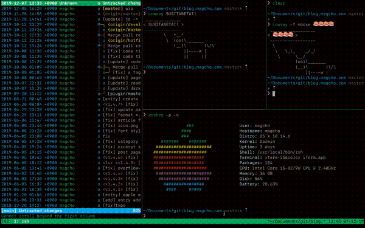

# 突然！私の開発環境

ミニアドベントカレンダーとして5人で5日間やってみようという企画、ついでにgitとPRの練習にもなる。とてもよい。

一巡目は、開発者であれば自分の開発環境になんらかのこだわりを持っているはず！そんなこだわりを簡単に聞いていこうという企画です。

## マシン周り
- PC
  - MacBook Pro 13.3-inch 4 port
- OS
  - MacOS(Mojave)
- キーボード
  - MBP標準(us)
  - Lily58
- マウス
  - なし

初めてPCを買った高校生の頃からmacシリーズを使い続けています。よく見る林檎信者では無いですがwindowsには無いスマホ、タブレット、時計を統一のプラットフォームで扱えることに魅力があります、特にクリップボード連携と作業を別端末でもシームレスに再開できるhandsoffは大変便利です。そこら辺Googleさんいかがでしょう？pixelは連携機能などあるのでしょうか？

そんな理由もありOSも周りがUbuntuにしている中、macOSを使いつづけています。

キーボードに関しては今のMBPにとても満足しています、世間ではMBPに搭載されているバタフライキーボードが打ちにくいとか、手が疲れるとかよく言われています。確かにHHKBのようなメカニカルが好きな人が多いですが自分はロープロでキーが軽いこのキーボードが好きです。

新型16-inch MBPにはバタフライではなく、以前より改良されたシザーが採用されバタフライはAppleの黒歴史のような扱いを受けてしまいました、悲しい。

さて、キーボードに関してただ一つ気になっていたことは、自分が極度の猫背でありキーボードに向かう横姿を見て悲しくなってしまったので椅子の背もたれに寄っかかりながらも楽な体制でキータイプできる分割キーボードを買いました。というより作りました、自作キーボードというやつですね。組み立ては終わっているのでキーマップを考えながら自作キーボードでこの記事を入力しています。

まだまだ使い始めたばかりで慣れ無いことが多いですが、早速沼にハマりそうな予感です。こればっかりは大学に3Dプリンタやレーザー加工機があるのが悪いですね。

## エディタ周り
- エディタ **emacs**
  - 起動時間が短い
  - vimのようなモードの概念がない
  - ESCを触らなくても使える
  - 設定、カスタマイズ、パッケージ開発のしやすさ
  - 入力補完, lint, formatter連携

- 今のエディタにたどり着いた遍歴
  サクラエディタ -> atom -> VSCode -> emacs
  
 

正規表現の置換をやりたくてサクラエディタを使っていた覚えがあります。そのあとはlintやformatterを使いたくてatomを使っていましたがMBAだったこともあり起動が遅くてストレスでした。どんなツールにせよ思った時に起動してすぐに使えるのがいいです、毎日使うエディタはもっての外です。

起動時間が短いエディタとしてはsublime editorがありますね、プラグインも入りますし起動時間が短いので恋に落ちてしまうのもわかります。ただ、デカいファイルに弱い印象。以前wikipediaからダンプしたcsvを開こうとしたらソフトが落ちました、悲しい。あとelecteonほどではないにしろメモリを食います。

エディタ戦争は歴史を見聞きするのみですがemacsに比べてvimの方がシェアが高く日本語の情報量が豊富ですね、最初はvimを試していたのですがESCキーの遠さや、プラグインが上手く使えず挫折し試しにemacsもやってみるかと始めたのがきっかけでした。

vimからemacsに移植されたpowerlineを使っています。emacsは言語ごとにシンタックスや入力補完、lint、formatterを自分で入れていくので好きに組み合わせることが出来ます。特にwebフロント系ではツールが乱立していますし、お気に入りのツールもあります。そしてemacsはTUIですがマウスが使えるのが結構便利です、tmuxともいい感じに使えます。

## ターミナル周り
- ターミナル **iTerm2**
  - どんな時でも呼び出せる
- shell: **zsh**
  - プラグインで入力補完や曖昧検索ができる
  - gitのブランチ名を表示できる
- その他
  - tmux
  - dotz
- フォント **SF MonoSquare(カスタム)**
  - 搭載されているグリフ(絵文字)の多さ
  - スクリプトで生成されているのでフォントをカスタマイズしやすい
  
 

macでは定番のiTerm2を使っています、このターミナルはウィンドウで表示することの他にオーバーレイ表示機能があります。全画面でブラウザを開いていても、デスクトップを切り替えても常に同じ位置に表示させることができ、ショートカットで表示非表示のトグルができます。作業環境によらずターミナルを表示できるのはとてもよいです。

シェルにはzshを使っています、ゼッシュって呼んでますが合ってますか？カワイイターミナルが使いたかったので一時期fishを使っていましたが環境変数関連でハマることが多く同じ様なカワイさにでき、bashrcをほぼ使いまわせるzshにしました。最新のmacOSはデフォルトシェルがzshになったと聞いたのでappleが自分に追い付いたんだと思います。

 
他にはマルチプレクサとしてtmuxを使っています、タブの様な機能を1つのセッション内でできる様になります。他にもステータスラインに情報を表示したり画面分割したりできます。これもマウスが使えます、とてもよい。

[dotz](https://github.com/magcho/dotz)は自分で作ったドットファイル管理ツールです。すでに様々な方々がツールを公開していますが自分用のセットアップ.shで完結できる様にしたかったのでhomebrewでインストールできる物を自作しました。

最後にフォントです、SF MonoSquareというMacに搭載されているMonoSquareをプログラミング用途に調整し、様々なフォント、アイコンフォントをくっつけたフォントです。[Qiita](https://qiita.com/delphinus/items/f472eb04ff91daf44274 ) に記事があります。自分はさらにpowerline用にGopher君やemacsのグリフなどを自分で追加したフォントを使っています。生成スクリプトはpythonなので簡単に手を入れられることがメリットです。

## まとめ
あまり長くならない様に使っているツールの紹介に留めましたがどんな設定にしているかを紹介する記事も書きたくなったのでそのうちあげるかもしれません。

さて、次に書いてくれるのはuが7個の@buuuuuuun3939です。よろしくです🍣
